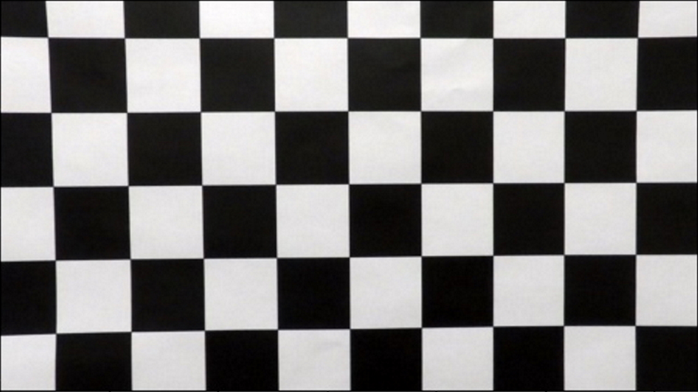
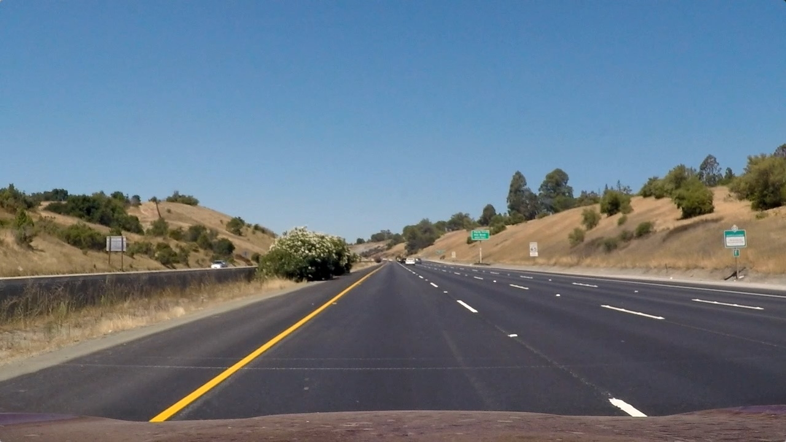
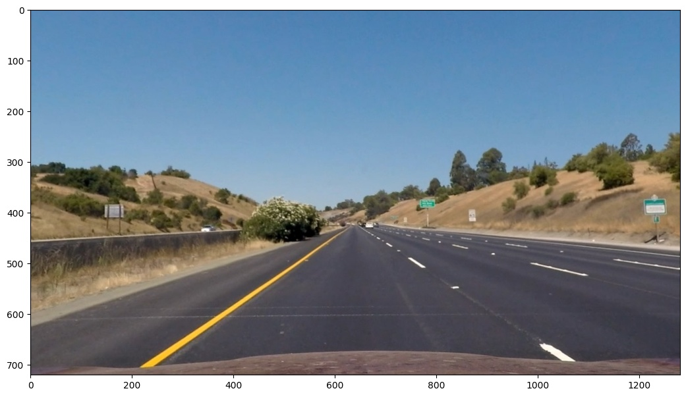
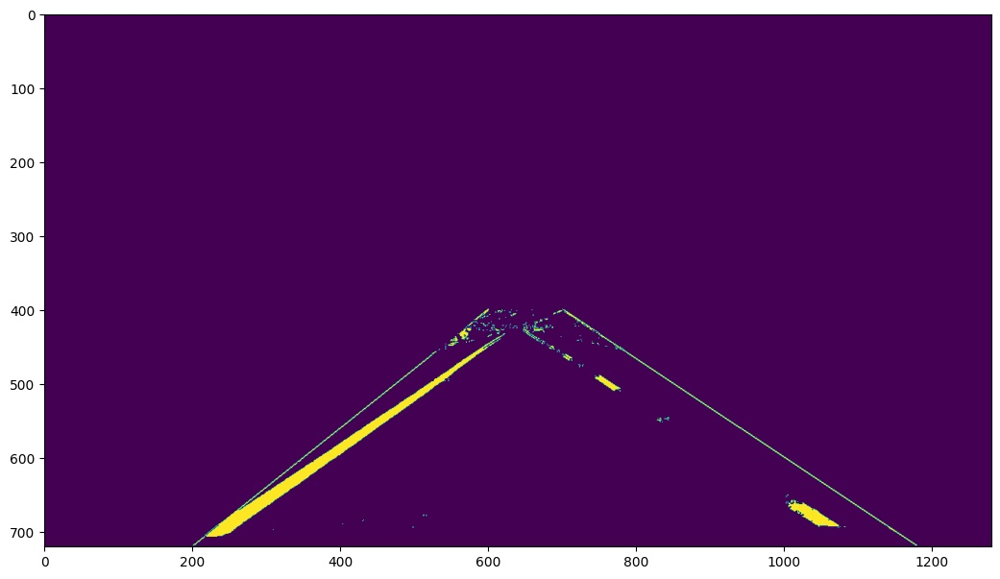
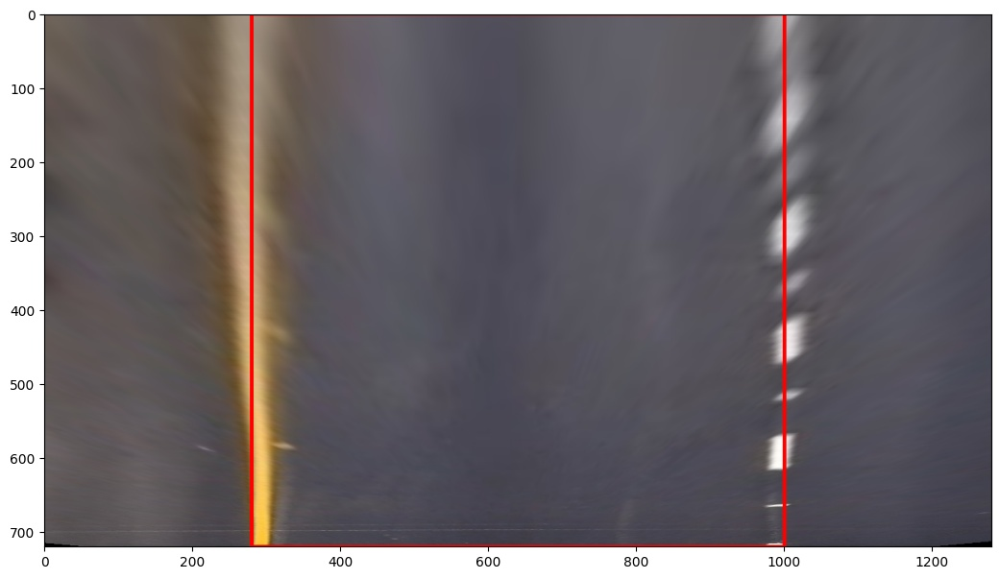
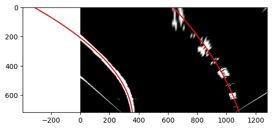
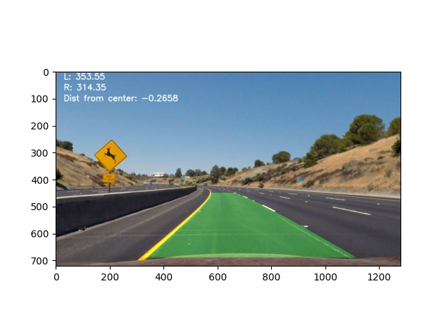

# Advanced Lane Finding
## A project to find lane lines from a video and output the location of the lines and the curvature of the two lane lines
### Overview
The project follows the following steps:
- Compute the camera calibration matrix and distortion coefficients given a set of chessboard images.
- Apply a distortion correction to all images
- Use HSV thresholding and a combination of different gradient transforms to produce one binary image with the lane lines highlighted
- Warp the binary image to a birds eye view using perspective transform
- Use histograms and sliding windows to determine which pixels belong to the lane lines and fit a polynomial to the lanes
- Determine the curvature of each lane
- Use a reverse perspective transform to warp the lane lines back to the original perspective
- Visualize the lane lines and output the curvature of each lane on the output image/video
The code is contained in a frame class that performs all operations automatically when given a new image and stores the line from the last frame for use in the next image. Future developments may include storing the last few frames for smoothing.
## Project Outline
### Camera Calibration
The code for the calibration is contained in the `calculate_distortion` function. It uses a predefined directory of chessboard images and some OpenCV voodoo to calculate the distortion matrix. A list `imgpoints` stores the 2d location of the chessboard corners for each calibration pictures received from the `cv2.findChessboardCorners` function. Another list `objpoints` stores the 3d location of where the chessboard corners are in the world. The `cv2.calibrateCamera` function uses these two lists to calculate the values needed to undistort each image. These values are stored in class variables to be used in the `undistort` function. The following images show the undistorted calibration image and the same image after distortion correction is applied.
|   |  |
|:---:|:---:|
| Original Image | Undistorted Image |
### Undistortion
After the distortion matrix is calculated, the `undistort` function undistorts each image. Here is a pipeline image undistorted.
|   |  |
|:---:|:---:|
| Original Image | Undistorted Image |
### Isolate Lines
Once the image is undistorted, the `isolate_lines`function uses several helper functions to isolate the lines and create a binary image containing only the lines. After masking the image with a region of interest, the function uses several variations of the sobel kernel in conjunction with HLS thresholding to isolate the lines.

### Image Transformation
After the lines are isolated, the image is transformed to a birds-eye view. The function `transform` takes an image and two sets of points to warp the image. It also takes a boolean as a parameter as an option to take reverse the transformation. My source and destination points are defined like so:
```  
  self.dst_offset = 280
  self.src = np.float32([[590, 450], 
                         [250, 690], 
                         [1075, 690], 
                         [690, 450]])
  self.dst = np.float32([[self.dst_offset, 0], 
                         [self.dst_offset, self.gray_image_shape[1]],
                         [self.gray_image_shape[0] - self.dst_offset, self.gray_image_shape[1]],
                         [self.gray_image_shape[0] - self.dst_offset, 0]])
```
Here is an undistorted image and the respective warped image. The lines are close to parallel 
|  |  |
|:---:|:---|
| Original Image | Undistorted Image |
### Lane Detection
After the lanes are isolated and the image is warped, the `detect_lanes` function fits a polynomial line to the lanes. This is the most complicated function in the class. It can find the lines from scratch or from a previous frame. To find the lines from scratch it takes a histogram of the bottom half of the image, and the two highest peaks in the histogram tell the algorithm where to start. It creates 9 windows which will be 'slid' up each line. It starts the first window centered on the two peaks of the histogram and adds all the pixels found in that window to an array of the left and right pixel coordinates depending on which lane they come from. It then re-centers the window based on where the mean of the pixels found is, and creates another window above it. This process repeats until the top of the image is reached. This results in two arrays, one containing the location of all the pixels in the left lane, and one containing all the pixels in the right lane. These are fed into a polynomial fit function and the lines are found and drawn on the image. If a previous line exists, the same process is repeated except instead of sliding windows, an area is created from a margin around the last known line, and the line is calculated from all the pixels in this area. The function to fit the pixels to a line stores the coefficients for a second degree polynomial equation in class variables. These are stored in both pixel values and in meters.

### Finding Curvature
This function uses the values of the two polynomials found in the lane detection process and calculates the radius of curvature for the left and right lanes using the following equation. It uses the polynomial values in meters as created by the previous function.\
^2)^\frac{3}{2}}{|2a|})

### Draw lane on original image
The final step of the process is to warp the polynomial lines back to the original undistorted image to visually show where the lanes are. The function `warp_boundaries` creates a blank image in the same shape as the warped image and draws the lane on it, after formatting the lines in a useable format for `cv2.fillPoly` It then uses the `transform` function with the inverse variable set to true to reverse the transformation. Finally it combines this unwarped image with the original undistorted image to create a final image with the lane line dawn on it, like so. The function also shows the radius of curvature for both lanes.

## Discussion
Originally, I had planned to have a line class that stores all the data for the line, but I found myself creating too many variables all over the place that were shared with some functions but not others, and it quickly became quite chaotic and I could not follow my code. I reformatted everything into a class that handled everything and automatically produced a final image when given a new image. The class lacks smoothing over multiple frames and can be quite slow, especially for long videos. It could also use some tuning to better isolate the lanes and transform the image. In the future I would like to implement an algorithm to automatically find points to transform the perspective, as every image is different. Some places the class may fail are places where the dashed lines are partially obscured, as it does reasonably well on solid lines. It may also be skewed by marks on the road that are not part of the lane lines.